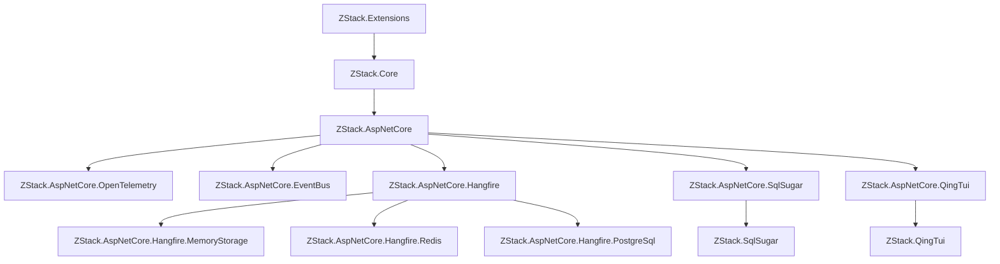

# ZStack快速开发框架

.NET基础库：  

ASP.NET Core基础库： 

ASP.NET Core组件库：  

## 项目结构



| 项目 | 说明 |
| ---- | ---- |
| [ZStack.Extensions](./framework/ZStack.Extensions/) | 扩展方法库：字符串、日期、集合、对象等扩展 |
| [ZStack.Core](./framework/ZStack.Core/) | 核心库：DI、日志(Serilog)、配置、异常、性能追踪 |
| [ZStack.AspNetCore](./framework/ZStack.AspNetCore/) | ASP.NET Core基础库：组件系统、规范化结果、OpenAPI |
| [ZStack.AspNetCore.EventBus](./framework/ZStack.AspNetCore.EventBus/) | 事件总线：基于EasyNetQ的消息发布与订阅 |
| [ZStack.AspNetCore.Hangfire](./framework/ZStack.AspNetCore.Hangfire/) | 任务调度：基于Hangfire的定时任务框架 |
| [ZStack.AspNetCore.SqlSugar](./framework/ZStack.AspNetCore.SqlSugar/) | SqlSugar组件：自动注册与分布式ID生成 |
| [ZStack.SqlSugar](./framework/ZStack.SqlSugar/) | SqlSugar基础库：多库管理、仓储、分页 |
| [ZStack.AspNetCore.QingTui](./framework/ZStack.AspNetCore.QingTui/) | 轻推组件：多应用管理与Token持久化 |
| [ZStack.QingTui](./framework/ZStack.QingTui/) | 轻推基础库：消息、通讯录、JS-SDK |
| [ZStack.AspNetCore.OpenTelemetry](./framework/ZStack.AspNetCore.OpenTelemetry/) | 遥测组件：Metrics与Tracing集成 |

## 开始使用

### 控制台程序

1. 添加NuGet包 `ZStack.Extensions`

2. Program.cs

```csharp
global using Microsoft.Extensions.DependencyInjection;
global using Serilog;
global using ZStack.Core;

var sp = AppHostBuilder.CreateHostBuilder(args).Build().Services;
var logger = sp.GetRequiredService<ILogger<Program>>();
logger.Information("Hello, World!");
```

### ASP.NET Core

1. 添加NuGet包 `ZStack.AspNetCore`

2. Program.cs

```csharp
var builder = WebApplication.CreateBuilder(args).Inject();
var app = builder.Build();
app.UseZStackInject();
app.Run();
```

3. Startup.cs

```csharp
[AppStartup(Order = 1)]
public class Startup : AppStartup
{
    public void ConfigureServices(IServiceCollection services)
    {
        services.AddControllersWithViews();
    }

    public void Configure(IApplicationBuilder app, IHostEnvironment env)
    {
        app.UseRouting();
        app.UseAuthorization();
    }
}
```

### 配置

在 `Configuration/` 目录下放置 JSON/INI/YAML 配置文件，框架会自动加载。环境特定文件（如 `app.Development.json`）会自动按环境筛选。

## CI/CD

- 普通 push 和 Pull Request 只执行还原、编译、测试和打包，不会发布 NuGet。
- 模板 CI 会额外还原、编译并验证 `templates/*/src` 中的脚手架项目。
- 每周一凌晨依赖任务会检查 `framework/ZStack.Framework.slnx` 中的 NuGet 包，并自动创建或更新依赖升级 PR。
- 发布时创建并推送版本 tag，例如 `git tag v10.9.1`、`git push origin v10.9.1`。`vMAJOR.MINOR.PATCH`（也支持不带 `v`）会触发 GitHub Release，使用 tag 版本打包所有 framework 和模板包，并发布到 NuGet。
- 仓库需要配置 Actions Secret：`NUGET_API_KEY`。
